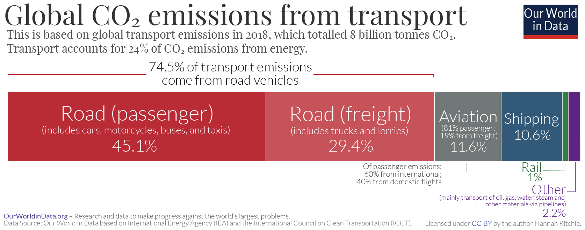
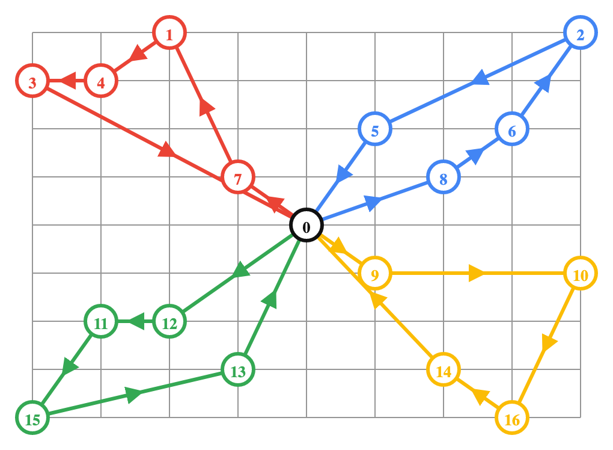

# mgt-530-sustainable-logistics
EPFL - Digitalization &amp; sustainable logistics

### Authors: Mathieu Bélanger, Yanis Cuche, Louis Delessert, Mia Frey, Sybille Roemer, Nicolas Wille

Insert here table of contents

## Introduction

All types of transportation account for one-fifth of global CO2 emissions. Of these, 45% come from passenger road transport, which includes commuters [1]. A breakdown of the CO2 emissions from transport can be found in Figure 1 [1].

<figure>
  <figcaption> Figure 1: Transport CO2 emissions by mode </figcaption>
  
</figure>

It should be noted that the efficiency of cars is increasing year after year. A car today emits on average 120gCO2 per kilometre driven compared to 170gCO2/km in 2001. In Switzerland it is 135gCO2/km, thus it is one of the highest in the world (cf. Figure 2) [2]. Although the reduction is ecologically beneficial, the average car occupancy rate in Switzerland is 1.6 persons per car in general but 1.1 for commuters [3]. Therefore, it shows the individualism of today's society despite the high density of public transportation in Switzerland. As another illustration, the share of public transportation in Switzerland has been a bit over 20% since 2006 but has just dropped to 15.6% by 2020 due to Covid-19 [4].

<figure>
  <figcaption> Figure 2: Average carbon intensity of new passenger vehicles </figcaption>
  
</figure>

Finally, in 2020, 8 out of 10 people were considered commuters in Switzerland. 71% of these individuals worked outside their home municipality, 12% more than in 1990. Moreover, 52% of these people used their car for their daily commute and 27% used public transportation (15% - train, 12% - other road transport) [5].

## Description of the problem

The aim of this project is to show a concrete application of the vehicle routing problem (VRP). 

The company is based in Vevey and has N employees who travel by car every day. For practical reasons (available parking spaces), socio-economic reasons (gas prices, road infrastructure, traffic jams, accidents), and ecological reasons (carbon emissions and nitrogen oxides from the road sector), we would like to set up a shuttle system. This system would consist in sending a certain number of shuttles, which drive an optimized route to pick up the employees at the beginning of the day, and then bring them back again at the end of the day. 

The first step consists of getting the data. To start, one should generate randomly the location of some employees around a given company. Two steps are required here: First, the location density of people living around this company needs to be gathered. Then, using this density, it is possible to generate employees around the company in a random manner. 

Once the random locations of the employees are determined, the next step consists of getting the travel time matrix and the distance matrix, including all the employees and also the company. For those matrices, there are 2 different ways to compute them:

1. The first is the simplest one, consisting of the euclidian distance between two locations.
2. The second is more complex but also more accurate. It consists of using the Google Maps API to enter two locations, and get the distance or time of going from one location to the other (i) by car, (ii) using public transportation, and (iii) by bike or foot. This one will be considered for this project, as it gives more precise results.

Once the travel time and distance matrices are generated, the final step is to apply the Vehicle Routing Problem. The challenge is to schedule each shuttle’s route while minimizing total travel time. Then, the resulting costs can be computed, given an average price of 70 ct/km for the shuttles [6], as well as the CO2 emissions, given an average emission rate of 105g/km per passenger [7]. At the end, each employee must be assigned a shuttle (as presented in Figure 3 below).

<figure>
  <figcaption> Figure 3: VRP illustration (source Google OR-Tools) </figcaption>
  
</figure>

## General VRP Mathematical Formulation

## Methodology

## Results & Analysis

## Conclusion

## Extensions

The VRP problem can have a few extensions: 

**1) Nearby employees commute with soft transportation (foot, bike, scooter, skateboard, roller, etc.)**

If an employee lives close to the office, they will not be considered for the model. The initial condition is that only people living more than 2 km far away from the office are considered for the model.

$$
if \ d_{i0} > 2 :  append\ i \ to \ V
$$

**2) People close to a train station take the train**

If an employee lives close to a train station, they will take the train to Vevey, and thus will not be considered for the model. Another initial condition is set that only considers people living more than 1 km away from a train station.

$$
if \ d_{it} > 1 :  append\ i \ to \ V, \ t \in (Lausanne, Montreux, Cully, ...)
$$

**3) Employees start/finish work at different times**

Three different employee classes are considered with the help of a distribution:

1. Starting at 7h and finishing at 16h (20%)
2. Starting at 8h and finishing at 17h (60%)
3. Starting at 9h and finishing at 18h (20%)

Accordingly, there will not only be one set of employees (V), but three different ones (V1, V2, and V3).

**4) Carsharing**

Instead of shuttles, some employees could take their own car and pick up their colleagues in the morning, and drop them off in the evening. Then, the center point 0 is no longer the company, but the points are the locations of the n people sharing their cars. 

**5) Include in the optimization the capacity of the shuttles

Indeed, including this parameter could impact the size of the shuttle that the company has to invest in. Therefore, a nice extension of this project would take into account the maximal number of employees in every shuttle. 

**6) Compare our results with existing softwares for routes optimization

- [https://www.motiontools.com/last-mile-delivery-stack?utm_feeditemid=&utm_device=c&utm_term=optimo route&utm_source=google&utm_medium=ppc&utm_campaign=&hsa_cam=18822924127&hsa_grp=141602889245&hsa_mt=b&hsa_src=g&hsa_ad=633048540873&hsa_acc={536-108-5031}&hsa_net=adwords&hsa_kw=optimo route&hsa_tgt=kwd-807794010618&hsa_ver=3&gclid=EAIaIQobChMI3qHF6PXT-wIV2PZRCh1HygAcEAAYASAAEgL5i_D_BwE](https://www.motiontools.com/last-mile-delivery-stack?utm_feeditemid=&utm_device=c&utm_term=optimo%20route&utm_source=google&utm_medium=ppc&utm_campaign=&hsa_cam=18822924127&hsa_grp=141602889245&hsa_mt=b&hsa_src=g&hsa_ad=633048540873&hsa_acc=%7B536-108-5031%7D&hsa_net=adwords&hsa_kw=optimo%20route&hsa_tgt=kwd-807794010618&hsa_ver=3&gclid=EAIaIQobChMI3qHF6PXT-wIV2PZRCh1HygAcEAAYASAAEgL5i_D_BwE) (for shuttles)
- [https://optimoroute.com/what-is-route-optimization/](https://optimoroute.com/what-is-route-optimization/) (for last mile delivery → More about bikes)
- [https://www.routexl.com/](https://www.routexl.com/) (what we do, free of use)
- [https://planner.myrouteonline.com/route-planner/](https://planner.myrouteonline.com/route-planner/) (what we do, free of use, and neat)
- [https://www.verizonconnect.com/ca/solutions/route-planning-software/](https://www.verizonconnect.com/ca/solutions/route-planning-software/)

## References

[1] ‘Cars, planes, trains: where do CO2 emissions from transport come from?’, *Our World in Data*. https://ourworldindata.org/co2-emissions-from-transport (accessed Nov. 27, 2022).

[2] H. Ritchie, M. Roser, and P. Rosado, ‘Energy’, *Our World Data*, Oct. 2022, Accessed: Nov. 27, 2022. [Online]. Available: https://ourworldindata.org/transport

[3] ‘Utilisation de la voiture comme mode de transport individuel: captivité modale, dépendance et alternatives.’ https://litra.ch/fr/news/utilisation-de-la-voiture-comme-mode-de-transport-individuel-captivite-modale-dependance-et-alternatives/ (accessed Nov. 28, 2022).

[4] O. fédéral de la statistique, ‘Transports publics’. https://www.bfs.admin.ch/bfs/fr/home/statistiken/mobilitaet-verkehr/querschnittsthemen/oeffentlicher-verkehr.html (accessed Nov. 28, 2022).

[5] O. fédéral de la statistique, ‘Pendularité’. https://www.bfs.admin.ch/bfs/fr/home/statistiken/mobilitaet-verkehr/personenverkehr/pendlermobilitaet.html (accessed Nov. 28, 2022).

[6] TCS, ‘Frais kilométriques’ https://www.tcs.ch/mam/Digital-Media/PDF/Booklets/frais-kilometriques.pdf (accessed Dec. 16, 2022)

[7] Our Wolrd in Data, 'Which form of transport has the smallest carbon footprint?' https://ourworldindata.org/travel-carbon-footprint (accessed Dec. 16, 2022)
